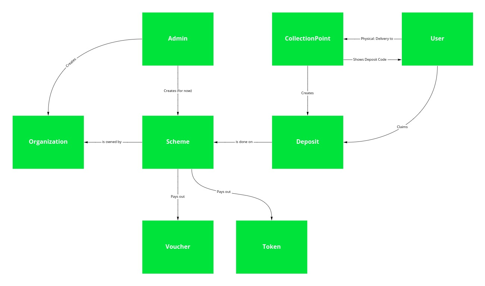
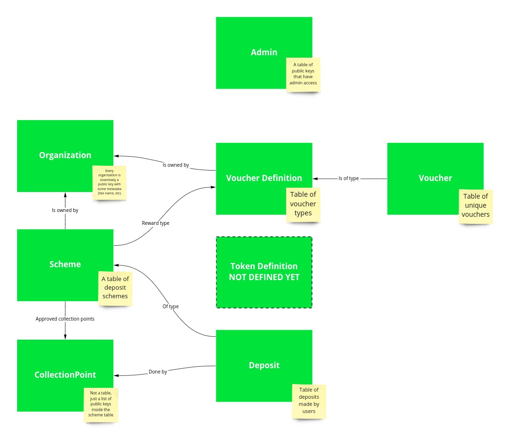

# Deposit Backend

This is a "temporary" solution for a backend for the deposit app. Eventually, this will be implemented on the EmpowerChain, but we want to test the Deposit App in different scenarios before we get that far. So we are starting with Plastic Credits on the EmpowerChain, and nailing down the specifics of the Deposit Schemes through this repo.

Take a look at the White Paper for more details: https://github.com/empowerchain/empowerchain

## Development

Set up Encore: https://encore.dev/docs/install

Test: `encore test ./... -p 1 -count=1`

Run locally: `encore run`

Generate new client code: `encore gen client deposit-pqu2 --env=staging --lang typescript --output client.ts`

## Auth

Auth is documented under [commons/auth.md](commons/auth.md).

## Logical flow

The following illustration documents the logical flow of data in the application:



## Data model

The following illustration documents the current data model and how the relations are built



## Usage documentation

### 1. SETUP: Admin
Many of the setup functions are currently admin-only. This means you need to either seed
the admin database with an admin public key or manually add it:
```shell
$ encore db shell admin --env staging # Example env
admin=> insert into admin VALUES('YOURPUBKEYGOESHERE');
```

### 2. SETUP: Organization
Schemes needs an organization, so create one using the `organization.CreateOrganization` API.

### 3. Voucher Definition / Token Definition
Schemes also need a reward definition id, so use for instance `deposit.CreateVoucherDefinition` API.

### 4. SETUP: Scheme
Create scheme with `scheme.CreateScheme`

### 5. SETUP: Add collection point
Add collection point(s) to the scheme with `scheme.AddCollectionPoint`

### 6. Make deposit
As the collection point, make a new deposit with `deposit.MakeDeposit`

### 7. Optional: Claim
If user pub key is not added in the initial deposit, the user needs to claim the deposit reward with: `deposit.Claim`